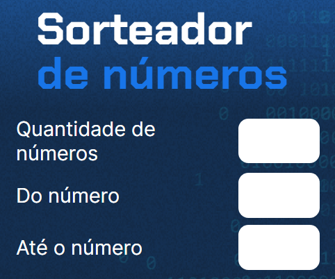
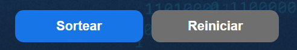
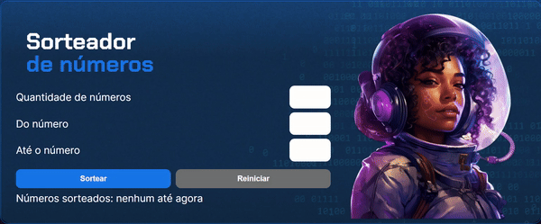

<h1 align = "center"> Sorteador de números </h1>

Projeto do curso "Lógica de programação: aprendendo com desafios" da Alura.

Consiste em uma página Web que sorteia uma quantidade de números escolhida pelo usuário em um intervalo também determinado pelo usuário.

    

<h2>:hammer: Funcionalidades do projeto </h2>

    

- `Sortear`: Quando clicado, o botão sortear executa a função principal do programa, que sorteia a quantidade de números inserida pelo usuário no intervalo determinado pelo usuário. 

- `Reiniciar`: Quando clicado, limpa os campos "Quantidade de números", "Do número" e "Até o número" e esvazia a lista de números sorteados, fazendo com que o programa possa ser executado novamente.

    

<h2> :heavy_check_mark: Tecnologias utilizadas </h2>

    
    
    
    

<h2> Autor </h2>
